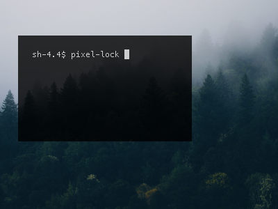

# Pixel lock

Lock screen bash script that pixelates the sessions current screen.
No lock icon, nor feedback to passphrase entry/attempt.
Type your passphrase while the session is locked and press enter to unlock.
Compatible with all aesthetics!

## Usage

1. Import the `plock.sh` script.
1. Make sure you have the dependencies: bash, ImageMagick, scrot, i3lock.
1. Give proper permissions to be executed: `chmod +x plock.sh`
1. Execute it with a value: `$ ./plock.sh 4`

### Automatic screen locking

If you want laptop lid shuts or other lock requests to lock your session with this, pair it with something like `xss-lock`.

    xss-lock -l -- /path/to/plock.sh 4 &

## Example images

An example screen:

An example of the lock screen with a pixel size of 5:

An example of the lock screen with a pixel size of 25:

## Little warning

If you pick a pixel size that your screen isn't divisible by, the lockscreen will either be slightly cropped or have a thin blank line added.

## Origins 

Based on [this](https://github.com/savoca/dotfiles/blob/gray/home/.bin/scripts/lock.sh) which I found [here](https://www.reddit.com/r/unixporn/comments/3358vu/i3lock_unixpornworthy_lock_screen/).
